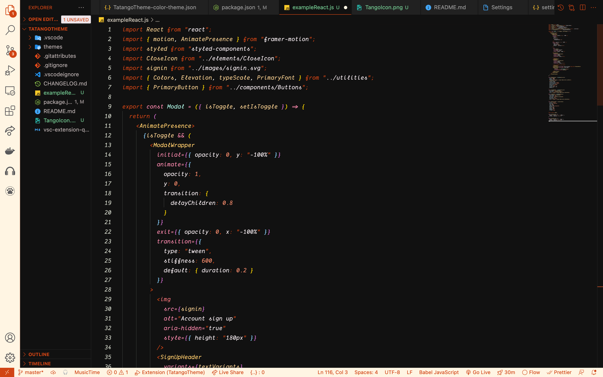

# NuTheme

### A beautifl dark theme with hints of awesome.

**Just give it a shot, you may like it... or dont**

**React Preview**

### Coming Soon...ish ### (don't pressure me)

- Whatever bugs me will change at somepoint
- More ScreenShots for your viewing pleasure.
- Light Mode will happen once im happy with the dark theme.
