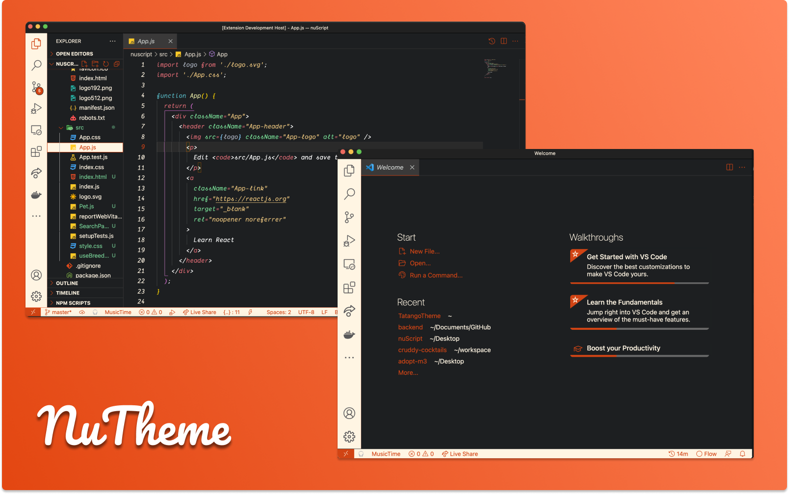
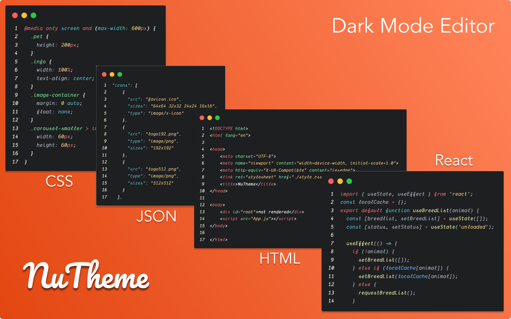

# NuTheme

### A beautiful dark theme with hints of awesome.

This is my first crack at a custom theme. I'll be using NuTheme in my personal development so any thing I've missed ill be sure to address.

[](https://marketplace.visualstudio.com/items?itemName=thewebdev.NuTheme)
[](https://marketplace.visualstudio.com/items?itemName=thewebdev.NuTheme)
[](https://marketplace.visualstudio.com/items?itemName=thewebdev.NuTheme)
[](https://marketplace.visualstudio.com/items?itemName=thewebdev.NuTheme)

# **Main Preview**



# **Editor Styles**



### Coming Soon

- Light Mode

The font in the preview image is Dank Mono, [available here](https://dank.sh/). Editor settings to activate font ligatures:

```
"editor.fontFamily": "Dank Mono",
"editor.fontLigatures": true,
```
